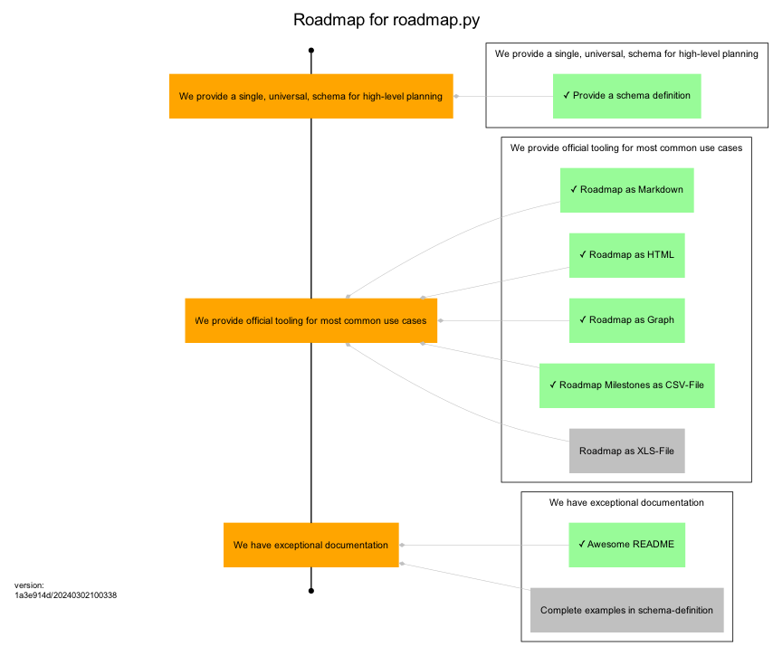

# roadmap
Manage your project and team roadmaps in YAML.

roadmap.py itself has a fancy roadmap as an living-example.
Take a look the rendered [markdown](roadmap/roadmap.md) of roadmap.py's-roadmap and the according definition in [examples/roadmap.yml](examples/roadmap.yml)

## Goals
My development approach is to enable teams or projects to structurize their development approaches in a structural and hopefull natural way.

Developing a roadmap is often a challenge: different user and stakeholder needs as well as technical dependencies, business goals and people-, time or budget-constrains must be harmonized in a meaningful way.  

The main work lies in describing and coordinating the content to be delivered and the order in which certain milestones or goals should or can be achieved.

In addition, most stakeholders have very different needs regarding the communication of roadmap content and the reporting of progress and achievements.

With roadmap.yml, it is possible to focus on the process of creation your roadmap.
Different communication needs can be addressed via the implemented views as HTML, dot or Markdown.
You are free, to implement your own views to fullfill your special stakeholder needs (and dont forget to make a merge-request ;-) ).

My experience with all the project management tools around is, that they are either heavily focused on progress tracking or collaboration. As a a dumb rule, they are mostly self-contained. 

What they are also usually very bad at, is the ability to focus on the content and support the process of creating a roadmap in the best possible way.

For me, a roadmap is a "living" document that should represent the thoughts and development steps of the roadmap itself in a versioned and structured way and offer the opportunity to derive the communication requirements from its structure.

If you are happy with your roadmap, just build some little piece of software to export your roadmap.yml into your prefered projectmanagement-tool.

## State of development
You can see the state of roadmap.pys objectives and keyresults in the following graph (rendered directly from [roadmap.yml](examples/roadmap.yml) )



## Whats inside the box?
I mainly focus on mapping the following structure:
 - Everything under **project** holds your project information, like your [vision](https://en.wikipedia.org/wiki/Vision_statement), important dates for your project, your objectives and your milesstones
- **Objectives** descripe central goals you might have to achieve. Objectives could be breaked down into **keyresults** - usefull if your team use [OKRs](https://en.wikipedia.org/wiki/Objectives_and_key_results). 
- **Milestones** are used as an indicator for overall-progress of certain features or capabilities. They could be used either on *project* or *objective* level. To break down a milestone into smaller pieces of work use **deliverables**. A deliverable could be a feature or capability or some work, you have to achieve before reaching the milestone.

Every objective, milestone, deliverable or keyresult can have a **reference** e.g. to your ticketsystem or detaildocument or whatsoever.

They also might have some **todos**, which are necessary to clarify the item, e.g. a open point or something to validate, some research work... 
The intend of the todos is around the roadmap creation process, not to do something to achieve an roadmap objective. 
But you are free to do it in your way.

The items have different **status** to describe commitment and achievments of the item.

Be aware: **Sequence is crucial**
The order of each item in your roadmap.yml indicates their logical or temporal sequence and will always take precedence over calculated or grouped order.

To understand all the different item attributes and status take a detailed look into **[schema/roadmap.md](schema/roadmap.md)**.

## Howto Use 

### Render Example
To render roadmap.py roadmap as an example: 
 - clone this repository
 - change to cloned directory
 - install requirements
 ```pip install -r requirements.txt```
- use roadmap.py to render the templates
```python3 roadmap.py```
- the rendered roadmap-files are located under **roadmap/** directory
- ```open roadmap/roadmap.md```in your prefered markdown editor
- ```open roadmap/roadmap.html```in your prefered browser
- ```open roadmap/roadmap.dot```in your prefered graphviz-engine

All the data for roadmap example is located under **examples/roadmap.yml**

### Adapt roadmap for your own needs

As a default, the roadmap data is located under **examples/roadmap.yml**.

You can modifiy this file according to your team or project needs inside this file.

A better way to do this is to use a separate folder outside the checked out repository for your team or project roadmap. 

If you use your own versioning-system like git, you are able to track all your changes on your own roadmap, make branches and publish in a consistent and open way. Use roadmap.py only for rendering and linting.

Create your own project folder, copy roadmap.yml as a starting point into your newly created directory. 

Next, create a folder for the rendered output your own directory, e.g. named *roadmap* .

There you have a good starting point for your own project.

#### Commandline Options
To render roadmap.yml in real world scenarios, you normaly have use it with commandline options

There are 2 Options:
- ```--roadmap-file```
    this is the path to your roadmap.yml
    default="examples/roadmap.yml
- ```--output-dir```
    this is the path to the rendered roadmap outputs
    default=OUTPUT_PATH from roadmap.env

e.g. if **your own directory** is located under */home/example/my_own_roadmap* and **roadmap.py** is located under */home/example/roadmap/* run : 
```
python3 /home/example/roadmap/roadmap.py --roadmap-file=/home/example/my_own_roadmap/roadmap.yml --output-dir=/home/example/my_own_roadmap/roadmap/
```

#### Use roadmap.json for linter support
To modify your roadmap you just need a text-editor. 
There are a bunch of editors out there. Some might have the ability to make auto-linting or support you with code-completion. 

To enable this, you might link **schema/roadmap.json** into your prefered text-editor.

## Credits
This project is heavyly inspired by https://github.com/SierraSoftworks/roadmap

